# The Cartographer
A sophisticated, lightweight solution for creating comprehensive project documentation and architecture maps. The Cartographer is designed to help onboard new team members (or agents) and maintain clear project understanding through automated documentation.

If everyone on the project is using the cartographer with a little bit of love and a little bit of care, you can keep your documentation consistently updated. And anytime an agent jumps in or a new member or if somebody's been away for a couple of days and they come back in and want to see the changes, it's just a great way to keep everybody updated.

## Saving State
The prompt will create a folder in your root directory called cartography and it will create a new version to cartography every time you run the prompt.

Every cartography run will look for the old cartography and use it to build upon itself. We've taken care to make sure that the agents don't get lazy and just copy and paste the old to the new. They actually need to go touch files and look at them.


## Overview

The Cartographer is a prompt-based solution that creates detailed, accurate maps of your codebase and project architecture. It works seamlessly with various AI coding assistants and requires no installation - it's just a prompt that you can use anywhere.


## Key Features

- **Zero Installation**: Works as a standalone prompt with any AI coding assistant
- **Comprehensive Documentation**: Creates detailed maps of your entire codebase
- **Versioned Output**: Maintains history of project documentation
- **Visual Architecture**: Includes Mermaid diagrams for clear visualization
- **Concise Format**: Keeps documentation under 500 lines while maintaining completeness
- **Strict Validation**: Requires exhaustive file coverage and validation of every file
- **Incremental Processing**: Processes files in small batches (10-15 files) to maintain accuracy. Writes to file every 3-5 documents interrogated to prevent context slippage and hallucination. 

## Constraints and Requirements

The Cartographer operates under several strict constraints to ensure high-quality documentation:

1. **Exhaustive File Coverage**
   - Must account for every file encountered during the scan
   - No files can be skipped or omitted
   - Each file must be validated and documented

2. **Incremental Processing**
   - Files must be processed in small batches (10-15 files)
   - Findings must be recorded incrementally
   - Prevents context loss and maintains accuracy

3. **Documentation Length**
   - Final cartography must be under 500 lines
   - Essential information must be prioritized
   - Conciseness is required while maintaining completeness

4. **Code References**
   - No embedded source code allowed
   - Must reference specific file paths and line numbers
   - Brief descriptions of code functionality instead of code blocks

5. **Visualization Standards**
   - Mermaid diagrams must use default theme or simple clean theme
   - No manual styling (e.g., `style Node fill...`)
   - Avoid complex color schemes or manual node formatting

## How It Works

The Cartographer follows a systematic approach to document your project:

1. Performs a complete scan of your project structure
2. Processes files in manageable batches
3. Creates versioned documentation files
4. Generates visual architecture diagrams
5. Maintains a clear record of project evolution

## Detailed Process

The Cartographer performs the following specific steps in sequence:

1. **Initialization and MCP Connection**
   - Activates MCP memory tool
   - Connects to MCP server
   - Reviews previous memories for historical context only

2. **Project Structure Discovery**
   - Performs a complete and exhaustive scan of the project's file structure
   - Records full paths of all files and directories
   - Creates a foundational list of all items requiring inspection

3. **Existing Cartography Review**
   - Reviews the latest cartography files for historical context
   - Focuses on understanding past structure
   - Does not assume accuracy of previous documentation

4. **Iterative File Inspection**
   - Processes files in manageable batches (10-15 files per batch)
   - For each file in a batch:
     - Inspects file contents
     - Determines purpose and core functionality
     - Identifies key relationships
     - Documents full file name and path

5. **Incremental Documentation**
   - Updates draft documentation after each batch
   - Records concise descriptions and relationships
   - Notes any discrepancies with previous documentation
   - Maintains progress to prevent context overload

6. **Versioned Documentation Creation**
   - Creates a new versioned document (e.g., `cartography/cartography.vX.md`)
   - Increments version number for each run
   - Consolidates findings from all batches

7. **Structure Synthesis**
   - Organizes findings by concern (API, UI/TUI, Services, etc.)
   - Creates clear sections for different components
   - Focuses on high-level architecture and interactions
   - Maintains documentation under 500 lines

8. **File Details Documentation**
   - Provides brief descriptions of file purposes
   - References full file paths
   - Uses file and line number references instead of code blocks
   - Maintains conciseness while being comprehensive

9. **Mermaid Chart Generation**
   - Creates simple Mermaid diagrams for:
     - Architecture visualization
     - Data flows
     - Component relationships
   - Uses standard Mermaid syntax
   - Avoids complex styling or themes

10. **Discrepancy Identification**
    - Lists significant differences from previous documentation
    - Highlights outdated information
    - Notes missing file documentation
    - Identifies incorrect relationship descriptions

11. **MCP Memory Update**
    - Updates MCP with run summary
    - Records new cartography file created
    - Notes major findings
    - Documents significant discrepancies

12. **Final Review**
    - Ensures documentation accuracy
    - Verifies all mentioned files exist
    - Confirms key relationships are captured
    - Checks adherence to all constraints

## Usage

Simply provide the cartographer.json prompt to your AI coding assistant. The Cartographer will:

- Create a new versioned documentation file
- Document all project files and their purposes
- Generate architecture diagrams
- Maintain a clear record of project structure

## Best Practices

- Use with an established role in your AI coding assistant for best results
- Run The Cartographer regularly to keep documentation up to date
- Review generated documentation for accuracy
- Use the documentation to onboard new team members

## Benefits

- **Quick Onboarding**: New team members can quickly understand project structure
- **Clear Architecture**: Visual representation of project components
- **Maintainable Documentation**: Versioned, concise, and up-to-date
- **No Setup Required**: Works immediately with any AI coding assistant

## Future Development

The Cartographer is continuously evolving. Future improvements will focus on:

- Enhanced visualization capabilities
- Improved documentation formats
- Better integration with various AI coding assistants
- Additional automation features

## License

MIT

## Contributing

Contributions are welcome! Please feel free to submit a Pull Request.


## Example

Here's an example of an actual cartography for a working project using Claude 3.5 Sonnet. 


---


# PitchCraft System Cartography v23

## 1. UI Component Architecture
### 1.1 Tab Navigation System

The application uses a dual-layer tab navigation system implemented through two key components:

**File: `pitchcraft-app/src/components/ui/TabNav.tsx`**
- Primary tab navigation component
- Implements basic tab switching with NeoBrutalist styling
- Fixed height content area with overflow scrolling
- Shadow effects for visual depth

**File: `pitchcraft-app/src/components/ui/TabSystem.tsx`**
- Enhanced tab system with responsive behavior
- Handles window resize events
- Dynamic right padding based on screen width:
  - 20% padding for screens > 1600px
  - 15% padding for screens > 1200px
  - 10% padding for screens > 800px
  - 5% padding for smaller screens

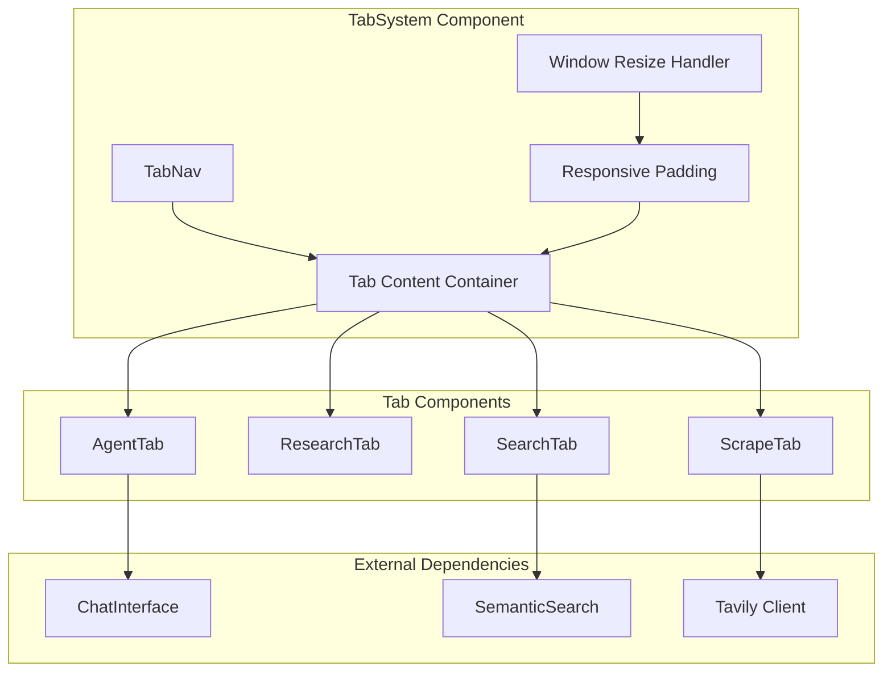
```mermaid
flowchart TD
    %% Define subgraphs first
    subgraph TabSystem["TabSystem Component"]
        TabNav["TabNav"]
        TabContent["Tab Content Container"]
        WindowResize["Window Resize Handler"]
        ResponsivePadding["Responsive Padding"]
    end

    subgraph Tabs["Tab Components"]
        AgentTab["AgentTab"]
        ResearchTab["ResearchTab"]
        SearchTab["SearchTab"]
        ScrapeTab["ScrapeTab"]
    end

    subgraph Dependencies["External Dependencies"]
        ChatInterface["ChatInterface"]
        SemanticSearch["SemanticSearch"]
        TavilyClient["Tavily Client"]
    end

    %% Define connections
    TabNav --> TabContent
    WindowResize --> ResponsivePadding
    ResponsivePadding --> TabContent

    %% Connect subgraphs
    TabContent --> AgentTab
    TabContent --> ResearchTab
    TabContent --> SearchTab
    TabContent --> ScrapeTab

    %% Connect to external dependencies
    AgentTab --> ChatInterface
    SearchTab --> SemanticSearch
    ScrapeTab --> TavilyClient
```

### 1.2 Tab Components

#### Agent Tab (`pitchcraft-app/src/components/tabs/AgentTab.tsx`)
- Primary interface for agent interaction
- Embeds ChatInterface component
- Accepts pitchDeckId for context

#### Research Tab (`pitchcraft-app/src/components/tabs/ResearchTab.tsx`)
- Complex research configuration interface
- Features:
  - Web/RAG research method toggle
  - Human-in-loop option
  - Section limit control (1-20)
  - Custom domains toggle
  - Custom instructions toggle
- Toast notifications for status updates

#### Search Tab (`pitchcraft-app/src/components/tabs/SearchTab.tsx`)
- Semantic search interface
- Keyword-agnostic search functionality
- Real-time results display
- Top 10 relevance-based results
- Integrated with semantic search system

#### Scrape Tab (`pitchcraft-app/src/components/tabs/ScrapeTab.tsx`)
- URL scraping functionality
- Dynamic URL input fields
- Integration with Tavily extraction API
- Progress indicators
- Toast notifications for status updates

### 1.3 UI Interactions and Dependencies

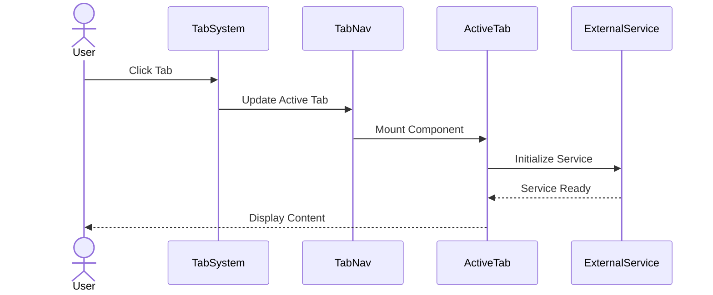
```mermaid
sequenceDiagram
    actor User
    participant TabSystem
    participant TabNav
    participant ActiveTab
    participant ExternalService

    User->>TabSystem: Click Tab
    TabSystem->>TabNav: Update Active Tab
    TabNav->>ActiveTab: Mount Component
    ActiveTab->>ExternalService: Initialize Service
    ExternalService-->>ActiveTab: Service Ready
    ActiveTab-->>User: Display Content
```

### 1.4 Styling System

All components use a consistent NeoBrutalist design system with:
- High contrast colors (black/white)
- Thick borders (2px black)
- Strong shadow effects
- Purple and yellow accent colors
- Bold typography

Common style classes:
```css
border-2 border-black
shadow-[6px_6px_0px_0px_rgba(0,0,0,1)]
bg-purple-300
bg-yellow-300
```

## 2. User Experience Flow

Each tab provides a specific functionality:

1. **Agent Tab**: Direct interaction with AI agents
2. **Research Tab**: Configure and initiate research tasks
3. **Search Tab**: Semantic search across collected data
4. **Scrape Tab**: URL content extraction and processing

The system maintains state consistency across tabs through:
- Shared deckId context
- Toast notification system
- Consistent styling
- Standard input/button components

## 3. Areas for Improvement

1. **Responsive Design**:
   - TabSystem implements responsive padding
   - Need more comprehensive responsive layout solutions
   - Consider mobile-first approach

2. **Tab Navigation**:
   - Current dual implementation (TabNav/TabSystem) needs consolidation
   - Consider unified tab navigation component
   - Add tab persistence across sessions

3. **Loading States**:
   - Implement consistent loading indicators
   - Add skeleton screens for content loading
   - Better error state handling

### 1.5 Tab Navigation Implementation Details

There are three tab-related components that serve different purposes:

#### SimpleTabLayout (`pitchcraft-app/src/components/ui/SimpleTabLayout.tsx`)
- Basic tab implementation using inline styles
- Full-width container with responsive flex layout
- Matches NeoBrutalist theme but uses direct style objects
- Fixed color scheme:
  - Active tab: #FDE047 (yellow)
  - Inactive tab: #D8B4FE (purple)
  - Background: #F3E8FF (light purple)

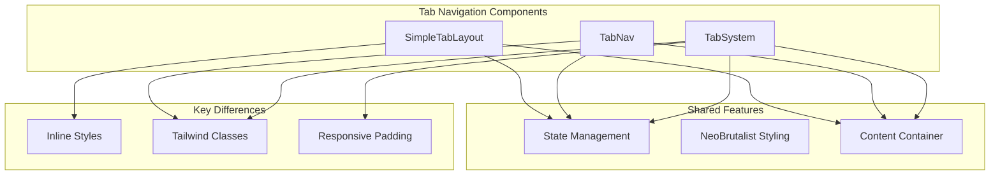
```mermaid
graph TB
    subgraph TabImplementations [Tab Navigation Components]
        SimpleTab[SimpleTabLayout]
        TabNav[TabNav]
        TabSystem[TabSystem]
    end

    subgraph SharedFeatures [Shared Features]
        State[State Management]
        Styling[NeoBrutalist Styling]
        ContentContainer[Content Container]
    end

    subgraph Differences [Key Differences]
        SimpleStyles[Inline Styles]
        TailwindStyles[Tailwind Classes]
        ResponsivePadding[Responsive Padding]
    end

    SimpleTab --> State
    TabNav --> State
    TabSystem --> State

    SimpleTab --> SimpleStyles
    TabNav --> TailwindStyles
    TabSystem --> TailwindStyles
    TabSystem --> ResponsivePadding

    SimpleTab --> ContentContainer
    TabNav --> ContentContainer
    TabSystem --> ContentContainer
```

### 1.6 UI Decorative Components

#### StarDecoration System (`pitchcraft-app/src/components/ui/StarDecoration.tsx`)
- Decorative star elements for corners of containers
- SVG-based implementation
- Position types: 'top-left' | 'top-right' | 'bottom-left' | 'bottom-right'
- Color variations:
  - Left stars: #9C5FFF (purple)
  - Right stars: #5FC9FF (blue)
- Dynamic sizing support (default: 60px)
- Container component with automatic star placement

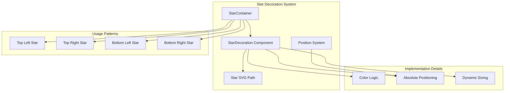
```mermaid
graph TB
    subgraph StarSystem [Star Decoration System]
        StarDec[StarDecoration Component]
        StarCont[StarContainer]
        SVG[Star SVG Path]
        Positions[Position System]
    end

    subgraph Implementation [Implementation Details]
        Colors[Color Logic]
        Placement[Absolute Positioning]
        Size[Dynamic Sizing]
    end

    StarDec --> SVG
    StarDec --> Colors
    StarDec --> Placement
    StarDec --> Size

    StarCont --> StarDec
    Positions --> Placement

    subgraph Usage [Usage Patterns]
        TopLeft[Top Left Star]
        TopRight[Top Right Star]
        BottomLeft[Bottom Left Star]
        BottomRight[Bottom Right Star]
    end

    StarCont --> TopLeft
    StarCont --> TopRight
    StarCont --> BottomLeft
    StarCont --> BottomRight
```

## 4. Navigation and Routing System

## 4. Navigation and Routing System

### 4.1 Core Navigation Components

#### ProtectedRoute (`pitchcraft-app/src/components/ProtectedRoute.tsx`)
- Authentication wrapper component
- Manages access control to protected routes
- Features:
  - Session state monitoring
  - Redirect to login with return path
  - Loading state handling
  - Path preservation during authentication

#### Authentication Context (`pitchcraft-app/src/context/AuthProvider.tsx`)
- Supabase authentication integration
- Session management
- Features:
  - User state tracking
  - Auth state change monitoring
  - Session persistence
  - Performance optimizations:
    - Memoized context values
    - Selective re-render prevention
    - Cleanup on unmount

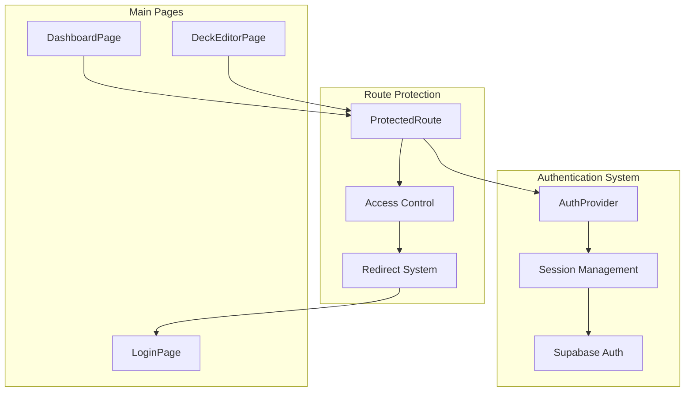
```mermaid
graph TB
    subgraph AuthSystem [Authentication System]
        Auth[AuthProvider]
        Session[Session Management]
        Supabase[Supabase Auth]
    end

    subgraph RouteProtection [Route Protection]
        ProtectedRoute[ProtectedRoute]
        AccessControl[Access Control]
        RedirectSystem[Redirect System]
    end

    subgraph Pages [Main Pages]
        Dashboard[DashboardPage]
        Editor[DeckEditorPage]
        Login[LoginPage]
    end

    Auth --> Session
    Session --> Supabase
    ProtectedRoute --> Auth
    ProtectedRoute --> AccessControl
    AccessControl --> RedirectSystem
    RedirectSystem --> Login

    Dashboard --> ProtectedRoute
    Editor --> ProtectedRoute
```

### 4.2 Page Structure

#### Dashboard Page (`pitchcraft-app/src/pages/DashboardPage.tsx`)
- Project listing and management
- Features:
  - Deck creation dialog
  - Grid layout for deck cards
  - Loading states with animations
  - Responsive design
  - Framer Motion animations

#### Deck Editor Page (`pitchcraft-app/src/pages/DeckEditorPage.tsx`)
- Main workspace for deck manipulation
- Tab-based interface with sections:
  - Agent interaction
  - URL scraping
  - File upload
  - Semantic search
  - Research tools
- Features:
  - Real-time deck data loading
  - Error handling with user feedback
  - Responsive layout system
  - Permission-based access control

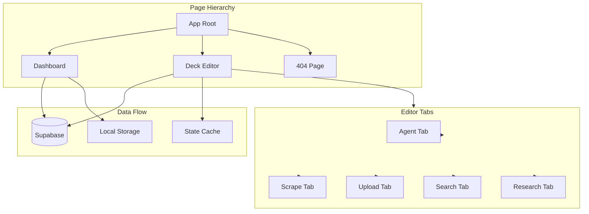
```mermaid
graph TB
    subgraph PageHierarchy [Page Hierarchy]
        App[App Root]
        Dashboard[Dashboard]
        Editor[Deck Editor]
        NotFound[404 Page]
    end

    subgraph EditorTabs [Editor Tabs]
        AgentTab[Agent Tab]
        ScrapeTab[Scrape Tab]
        UploadTab[Upload Tab]
        SearchTab[Search Tab]
        ResearchTab[Research Tab]
    end

    subgraph DataFlow [Data Flow]
        Supabase[(Supabase)]
        Cache[State Cache]
        LocalStorage[Local Storage]
    end

    App --> Dashboard
    App --> Editor
    App --> NotFound

    Editor --> EditorTabs
    EditorTabs --> AgentTab
    EditorTabs --> ScrapeTab
    EditorTabs --> UploadTab
    EditorTabs --> SearchTab
    EditorTabs --> ResearchTab

    Dashboard --> Supabase
    Editor --> Supabase
    Editor --> Cache
    Dashboard --> LocalStorage
```

### 4.3 Route Configuration

Main application routes:
- `/login` - Authentication entry point
- `/dashboard` - Project management hub
- `/deck/:deckId` - Individual deck editor
- `*` - 404 Not Found handler

Route protection strategy:
1. All routes except `/login` are protected
2. Authentication state check on route access
3. Return path preservation during redirects
4. Loading states during auth checks

## 5. Semantic Search Infrastructure

### 5.1 Embeddings Library (`pitchcraft-app/src/lib/embeddings.ts`)
- Integration with Google's Generative AI
- Models:
  - Embeddings: text-embedding-004
  - Text Generation: gemini-2.5-pro-preview-03-25
- Key functionalities:
  - Batch embedding generation
  - File content extraction
  - Text summarization
  - Vector similarity search

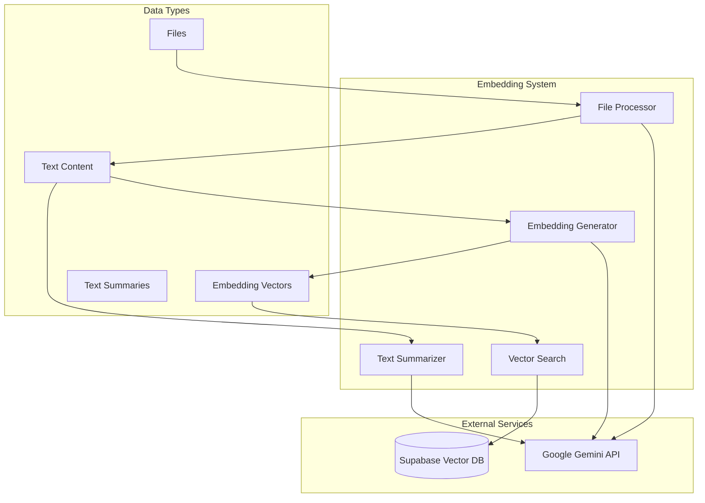
```mermaid
graph TB
    subgraph EmbeddingSystem [Embedding System]
        Generator[Embedding Generator]
        FileProcessor[File Processor]
        Summarizer[Text Summarizer]
        VectorSearch[Vector Search]
    end

    subgraph ExternalServices [External Services]
        GeminiAPI[Google Gemini API]
        SupabaseVDB[(Supabase Vector DB)]
    end

    subgraph DataTypes [Data Types]
        Text[Text Content]
        Files[Files]
        Vectors[Embedding Vectors]
        Summaries[Text Summaries]
    end

    Generator --> GeminiAPI
    FileProcessor --> GeminiAPI
    Summarizer --> GeminiAPI
    VectorSearch --> SupabaseVDB

    Text --> Generator
    Files --> FileProcessor
    FileProcessor --> Text
    Text --> Summarizer
    Generator --> Vectors
    Vectors --> VectorSearch
```

### 5.2 Search Components

#### SemanticSearch Component (`pitchcraft-app/src/components/SemanticSearch.tsx`)
- Core search interface implementation
- Features:
  - Real-time query processing
  - Embedding generation
  - Results management
  - Error handling
  - Loading states
  - Results drawer integration

#### SearchResultsDrawer (`pitchcraft-app/src/components/SearchResultsDrawer.tsx`)
- Results presentation interface
- Features:
  - Radix Dialog integration
  - Document preview
  - Source metadata display
  - Result details modal
  - Responsive layout

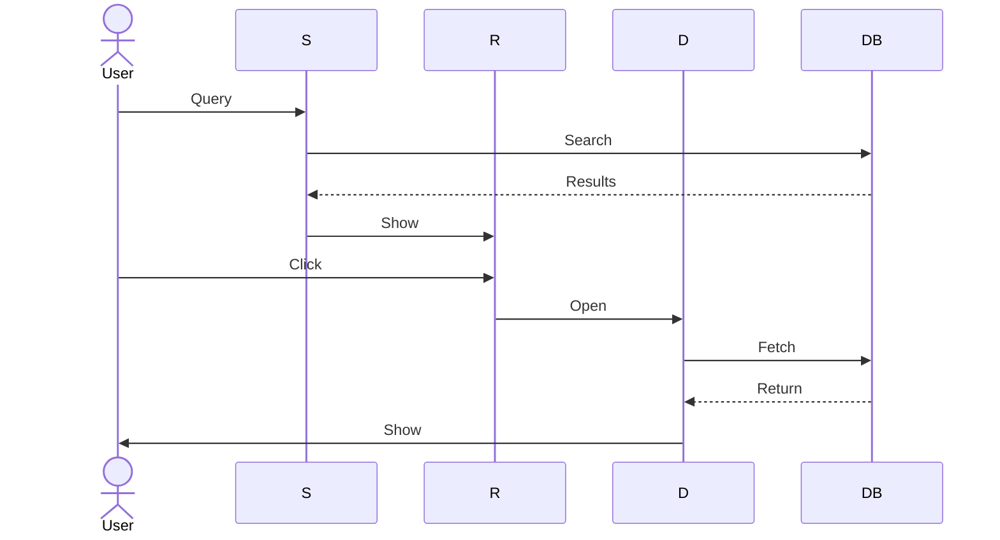
```mermaid
sequenceDiagram
    actor User
    participant S
    participant R
    participant D
    participant DB

    User->>S: Query
    S->>DB: Search
    DB-->>S: Results
    S->>R: Show
    User->>R: Click
    R->>D: Open
    D->>DB: Fetch
    DB-->>D: Return
    D->>User: Show
```

### 5.3 Technical Implementation Details

#### Embedding Generation
- Batch size: 100 items
- Size limit: 30,000 bytes per chunk
- Error handling with retries
- Progress logging
- Metadata preservation

#### Vector Storage Strategy
- Supabase pgvector integration
- Schema:
  - Content: Text field
  - Embedding: Vector field
  - Metadata: JSONB field
  - Pitch deck reference
  - Timestamps

#### Search Process:
1. Query text normalization
2. Embedding vector generation
3. Similarity search (cosine distance)
4. Results ranking and filtering
5. UI presentation layer

### 5.4 Performance Considerations

1. **Batching Optimizations**:
   - Chunk size limits
   - Batch processing
   - Rate limiting
   - Error recovery

2. **Vector Search Tuning**:
   - Similarity threshold: 0.7 default
   - Result count limiting
   - Index optimization
   - Query caching

3. **UI Responsiveness**:
   - Loading states
   - Progressive rendering
   - Error boundaries
   - Result pagination

### 5.5 Document Details System

#### DocumentDetailsModal (`pitchcraft-app/src/components/DocumentDetailsModal.tsx`)
- Full document content viewer
- Features:
  - File metadata display
  - Document summary view
  - Full text display
  - Responsive modal design
  - Error handling
  - Loading states

#### Document Data Flow
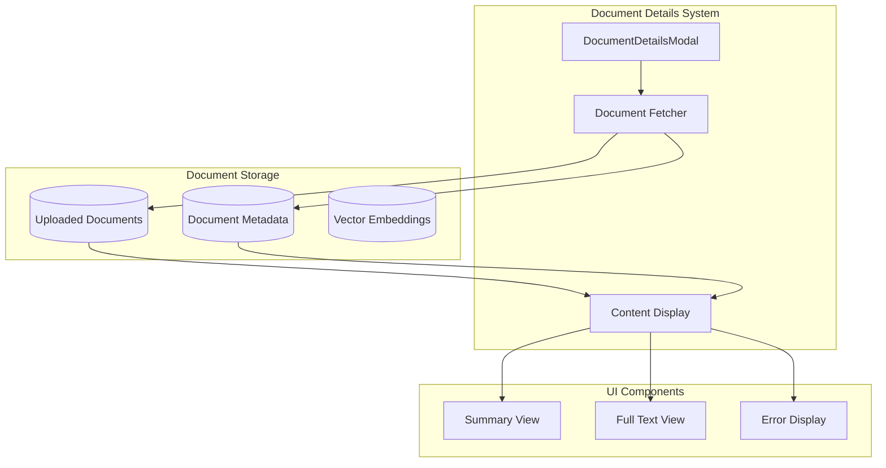
```mermaid
graph TB
    subgraph DetailsSystem [Document Details System]
        Modal[DocumentDetailsModal]
        DataFetcher[Document Fetcher]
        ContentDisplay[Content Display]
    end

    subgraph Storage [Document Storage]
        UploadedDocs[(Uploaded Documents)]
        Metadata[(Document Metadata)]
        Embeddings[(Vector Embeddings)]
    end

    subgraph Display [UI Components]
        Summary[Summary View]
        FullText[Full Text View]
        ErrorState[Error Display]
    end

    Modal --> DataFetcher
    DataFetcher --> UploadedDocs
    DataFetcher --> Metadata
    
    ContentDisplay --> Summary
    ContentDisplay --> FullText
    ContentDisplay --> ErrorState

    UploadedDocs --> ContentDisplay
    Metadata --> ContentDisplay
```

#### Complete Search and Document Flow

```mermaid
sequenceDiagram
    actor User
    participant S
    participant R
    participant D
    participant DB

    User->>S: Query
    S->>DB: Search
    DB-->>S: Results
    S->>R: Show
    User->>R: Click
    R->>D: Open
    D->>DB: Fetch
    DB-->>D: Return
    D->>User: Show
```

### 5.6 Component Interactions

1. **Document Access Flow**:
   - Search matches to vector embeddings
   - Result selection triggers document fetch
   - Full document content loaded on demand
   - Summary and full text display options

2. **Data Synchronization**:
   - Metadata consistency checks
   - Document ID verification
   - Error state propagation
   - Loading state management

3. **UI/UX Considerations**:
   - Progressive content loading
   - Responsive modal sizing
   - Content overflow handling
   - Error message clarity

## 6. File Upload and Processing Infrastructure

### 6.1 Upload Components

#### Upload Tab (`pitchcraft-app/src/components/tabs/UploadTab.tsx`)
- Entry point for file uploads
- Container component for FileUploadForm
- Progress notification handling
- Success state management

#### FileUploadForm (`pitchcraft-app/src/components/editor/FileUploadForm.tsx`)
- Core file upload interface
- Features:
  - Drag and drop support
  - Multiple file selection
  - Progress tracking
  - Extensive file type support
  - File validation
  - Comprehensive error handling

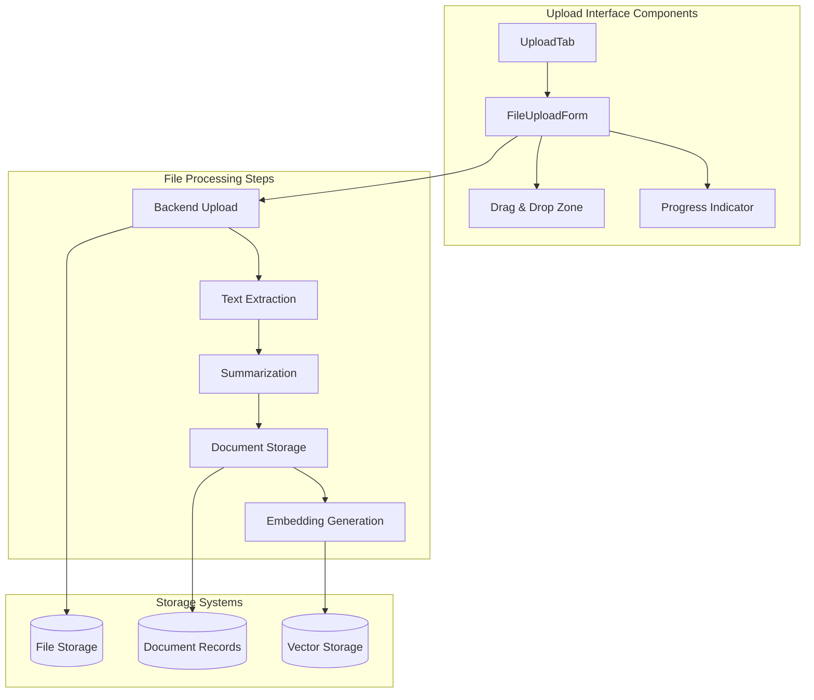
```mermaid
graph TB
    subgraph UploadInterface [Upload Interface Components]
        Upload[UploadTab]
        Form[FileUploadForm]
        DragDrop[Drag & Drop Zone]
        Progress[Progress Indicator]
    end

    subgraph ProcessingSteps [File Processing Steps]
        Step1[Backend Upload]
        Step2[Text Extraction]
        Step3[Summarization]
        Step4[Document Storage]
        Step5[Embedding Generation]
    end

    subgraph Storage [Storage Systems]
        Files[(File Storage)]
        Documents[(Document Records)]
        Vectors[(Vector Storage)]
    end

    Upload --> Form
    Form --> DragDrop
    Form --> Progress

    Form --> Step1
    Step1 --> Files
    Step1 --> Step2
    Step2 --> Step3
    Step3 --> Step4
    Step4 --> Documents
    Step4 --> Step5
    Step5 --> Vectors
```

### 6.2 File Processing Pipeline

#### Step 1: Initial Upload
- Backend upload via FormData
- File validation and type checking
- Progress tracking
- Error handling

#### Step 2: Text Extraction
- Uses Gemini API for content extraction
- Multi-format support:
  - Document formats (PDF, Office, etc.)
  - Images (OCR capability)
  - Audio transcription
  - Video content extraction

#### Step 3: Content Processing
- Text summarization
- Chunk generation
- Metadata extraction
- Format-specific handling

#### Step 4: Data Storage
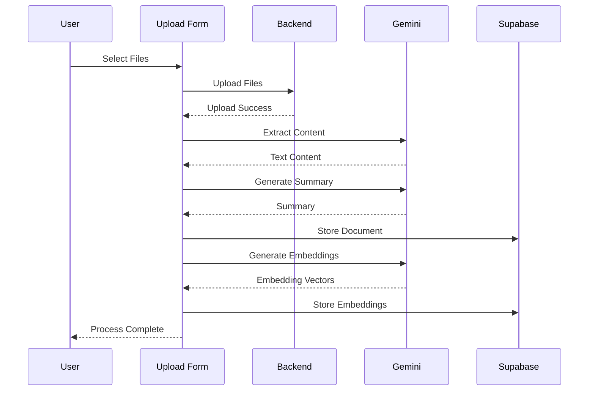
```mermaid
sequenceDiagram
    participant User
    participant Form as Upload Form
    participant Backend
    participant Gemini
    participant Supabase
    
    User->>Form: Select Files
    Form->>Backend: Upload Files
    Backend-->>Form: Upload Success
    Form->>Gemini: Extract Content
    Gemini-->>Form: Text Content
    Form->>Gemini: Generate Summary
    Gemini-->>Form: Summary
    Form->>Supabase: Store Document
    Form->>Gemini: Generate Embeddings
    Gemini-->>Form: Embedding Vectors
    Form->>Supabase: Store Embeddings
    Form-->>User: Process Complete
```

### 6.3 Supported File Types

1. Documents
   - Microsoft Office (Modern/Legacy)
   - OpenDocument Formats
   - PDF, RTF, TXT
   - Markdown, HTML, XML

2. Media Files
   - Images: JPEG, PNG, WEBP, GIF, etc.
   - Audio: WAV, MP3, AAC, FLAC
   - Video: MP4, MPEG, MOV, AVI

3. Professional Formats
   - CAD: DWG, DXF
   - Vector: SVG, EPS, AI
   - Design: PSD, INDD
   - 3D: STL

4. Data and Code
   - CSV, JSON, XML
   - JavaScript, Python
   - SQL, SQLite
   - Various text formats

### 6.4 Error Handling and Recovery

1. **Upload Errors**:
   - Network failure recovery
   - File size limits
   - Type validation
   - Duplicate handling

2. **Processing Errors**:
   - Extraction failures
   - Summary generation issues
   - Embedding errors
   - Storage conflicts

3. **User Feedback**:
   - Progress indicators
   - Error messages
   - Success notifications
   - Status updates

## 7. Research System

### 7.1 Research Interface

#### ResearchTab (`pitchcraft-app/src/components/tabs/ResearchTab.tsx`)
- Primary research configuration interface
- Features:
  - Dual research methods (web/RAG)
  - Human-in-loop option
  - Section limit control (1-20)
  - Domain customization
  - Custom instruction support
  - Progress tracking
  - Result preview

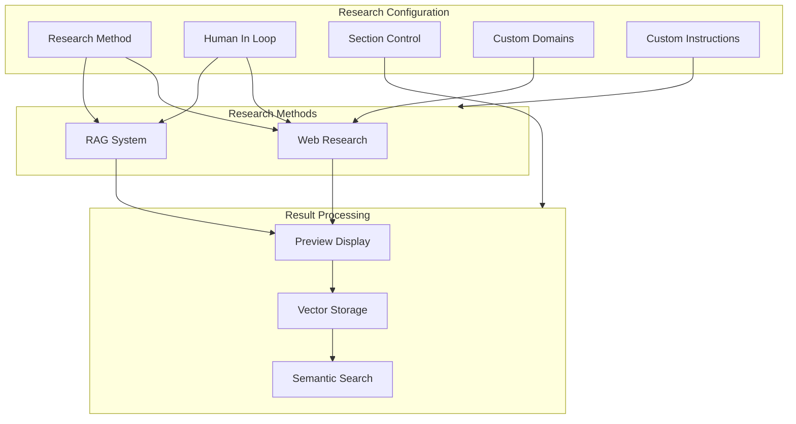
```mermaid
graph TB
    subgraph ResearchConfig [Research Configuration]
        Method[Research Method]
        Human[Human In Loop]
        Sections[Section Control]
        Domains[Custom Domains]
        Instructions[Custom Instructions]
    end

    subgraph Methods [Research Methods]
        Web[Web Research]
        RAG[RAG System]
    end

    subgraph Results [Result Processing]
        Preview[Preview Display]
        Storage[Vector Storage]
        Search[Semantic Search]
    end

    Method --> Web
    Method --> RAG
    Human --> Web
    Human --> RAG
    Sections --> Results
    Domains --> Web
    Instructions --> Methods

    Web --> Preview
    RAG --> Preview
    Preview --> Storage
    Storage --> Search
```

### 7.2 Research Methods

#### Web Research
- External web content analysis
- Features:
  - Custom domain filtering
  - Section count control
  - Human verification option
- Planned integrations:
  - Search API integration
  - Web scraping capabilities
  - Content filtering

#### RAG (Retrieval Augmented Generation)
- Internal knowledge base utilization
- Features:
  - Vector similarity search
  - Context-aware responses
  - Document cross-referencing
- Integration points:
  - Supabase vector store
  - Gemini embeddings
  - Document processing

### 7.3 Research Flow Sequence

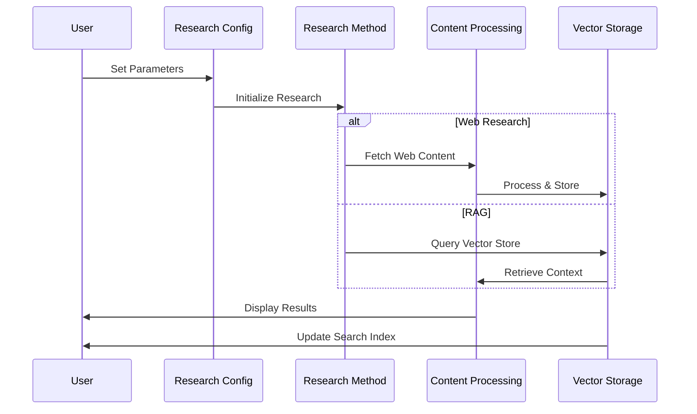
```mermaid
sequenceDiagram
    participant User
    participant Config as Research Config
    participant Method as Research Method
    participant Processing as Content Processing
    participant Storage as Vector Storage

    User->>Config: Set Parameters
    Config->>Method: Initialize Research
    
    alt Web Research
        Method->>Processing: Fetch Web Content
        Processing->>Storage: Process & Store
    else RAG
        Method->>Storage: Query Vector Store
        Storage->>Processing: Retrieve Context
    end
    
    Processing->>User: Display Results
    Storage->>User: Update Search Index
```

### 7.4 Implementation Status

Current State:
- UI implementation complete
- Configuration system in place
- Research methods defined
- Results preview layout ready

Pending Implementation:
1. Research Engine:
   - Web scraping functionality
   - RAG system integration
   - Result processing
   - Vector storage updates

2. Integration Points:
   - Search API connection
   - Vector store querying
   - Document processing
   - Result formatting

## 8. URL Scraping System

### 8.1 Scraping Interface

#### ScrapeTab (`pitchcraft-app/src/components/tabs/ScrapeTab.tsx`)
- Dynamic URL scraping interface
- Features:
  - Multiple URL input fields
  - Dynamic field addition
  - Individual URL processing
  - Progress tracking
  - Error handling
  - Toast notifications

#### Tavily Client (`pitchcraft-app/src/lib/tavily-client.ts`)
- Web content extraction implementation
- Features:
  - Basic/advanced extraction modes
  - Batch URL processing
  - Error recovery
  - Response normalization
  - Image extraction

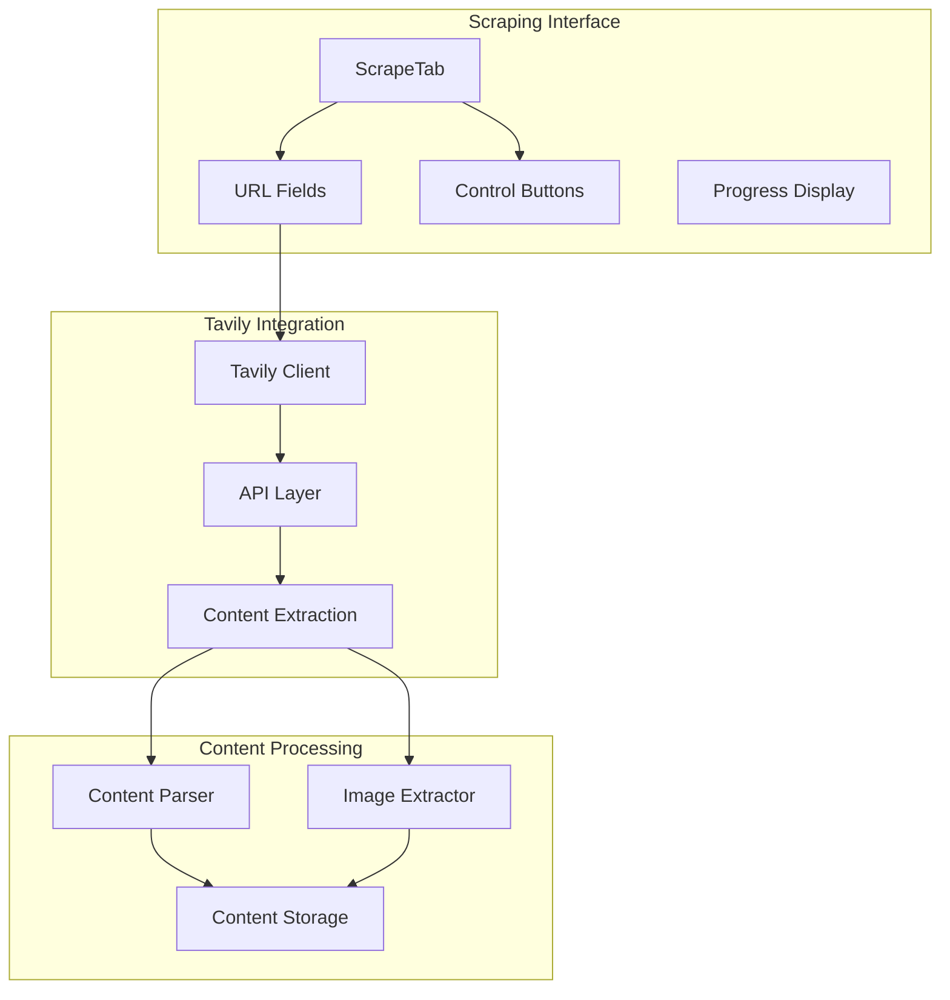
```mermaid
graph TB
    subgraph ScrapeInterface [Scraping Interface]
        Tab[ScrapeTab]
        Fields[URL Fields]
        Controls[Control Buttons]
        Progress[Progress Display]
    end

    subgraph TavilySystem [Tavily Integration]
        Client[Tavily Client]
        API[API Layer]
        Extraction[Content Extraction]
    end

    subgraph ContentProcessing [Content Processing]
        Parser[Content Parser]
        Images[Image Extractor]
        Storage[Content Storage]
    end

    Tab --> Fields
    Tab --> Controls
    Fields --> Client
    Client --> API
    API --> Extraction
    Extraction --> Parser
    Extraction --> Images
    Parser --> Storage
    Images --> Storage
```

### 8.2 Data Flow Sequence

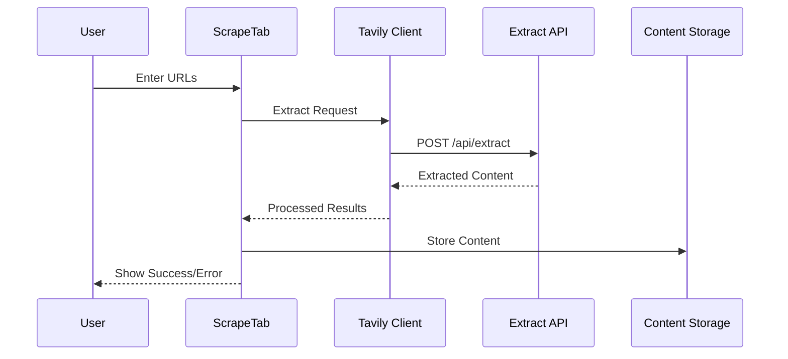
```mermaid
sequenceDiagram
    participant User
    participant UI as ScrapeTab
    participant Client as Tavily Client
    participant API as Extract API
    participant Storage as Content Storage

    User->>UI: Enter URLs
    UI->>Client: Extract Request
    Client->>API: POST /api/extract
    API-->>Client: Extracted Content
    Client-->>UI: Processed Results
    UI->>Storage: Store Content
    UI-->>User: Show Success/Error
```

### 8.3 Implementation Details

#### Extraction Parameters
- URL validation
- Extraction depth options:
  - Basic: Main content
  - Advanced: Full page analysis
- Response format:
  ```typescript
  interface TavilyExtractResult {
    success: boolean
    data?: {
      results: Array<{
        url: string
        raw_content: string
        images: Array<string>
      }>
      failed_results: Array<{
        url: string
        error: string
      }>
      response_time: number
    }
    error?: string
  }
  ```

#### Error Handling
1. Network Errors:
   - Connection failures
   - Timeout handling
   - Retry logic

2. Content Errors:
   - Invalid URLs
   - Failed extractions
   - Parsing issues

3. Recovery Strategy:
   - Individual URL retries
   - Partial success handling
   - Error reporting

### 8.4 Content Processing

1. **Extraction Process**:
   - URL validation
   - Content fetching
   - HTML parsing
   - Image extraction
   - Text normalization

2. **Storage Integration**:
   - Raw content storage
   - Content indexing
   - Image references
   - Metadata tracking

3. **Performance Considerations**:
   - Parallel processing
   - Rate limiting
   - Response caching
   - Error recovery

## 9. AI Agent System

### 9.1 Agent Interface Components

#### AgentTab (`pitchcraft-app/src/components/tabs/AgentTab.tsx`)
- Container component for ChatInterface
- Pitch deck context provider
- Direct interaction point with AI assistant

#### ChatInterface (`pitchcraft-app/src/components/editor/ChatInterface.tsx`)
- Core AI interaction interface
- Features:
  - Real-time chat streaming
  - Message history management
  - Function calling integration
  - RAG capability via semantic search
  - Typing indicators
  - Message animations

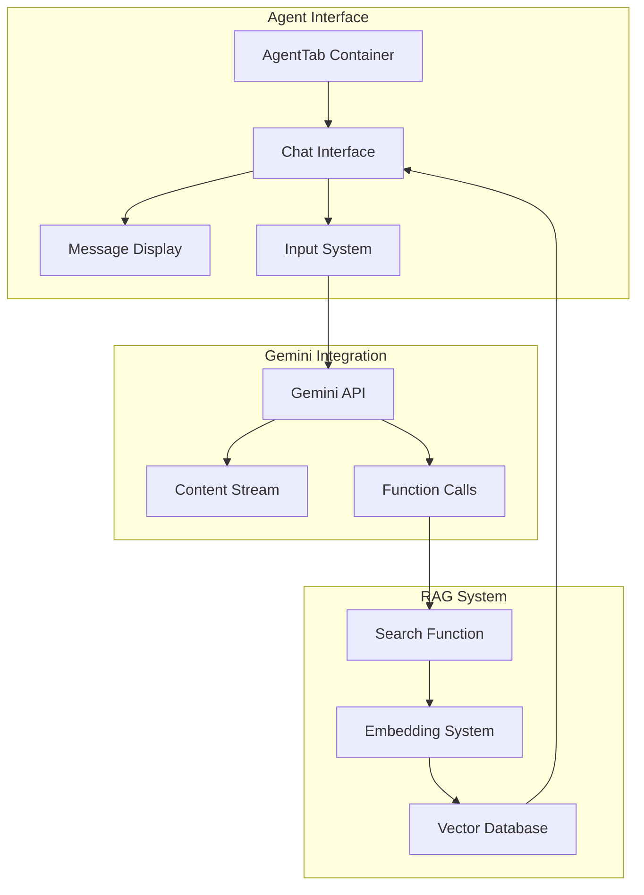
```mermaid
graph TB
    subgraph AgentComponents [Agent Interface]
        AgentTab[AgentTab Container]
        ChatUI[Chat Interface]
        Messages[Message Display]
        Input[Input System]
    end

    subgraph GeminiSystem [Gemini Integration]
        API[Gemini API]
        Stream[Content Stream]
        Functions[Function Calls]
    end

    subgraph RAGSystem [RAG System]
        Search[Search Function]
        Embeddings[Embedding System]
        VectorDB[Vector Database]
    end

    AgentTab --> ChatUI
    ChatUI --> Messages
    ChatUI --> Input
    Input --> API
    API --> Stream
    API --> Functions
    Functions --> Search
    Search --> Embeddings
    Embeddings --> VectorDB
    VectorDB --> ChatUI
```

### 9.2 Gemini Integration (`pitchcraft-app/src/lib/gemini.ts`)
- Gemini Pro model integration
- Configuration:
  - Model: gemini-2.5-pro-preview-03-25
  - Temperature: 0.1
  - Max tokens: 8192
  - Safety settings disabled for testing
- Features:
  - Streaming responses
  - Function calling
  - System instructions
  - Chat history management

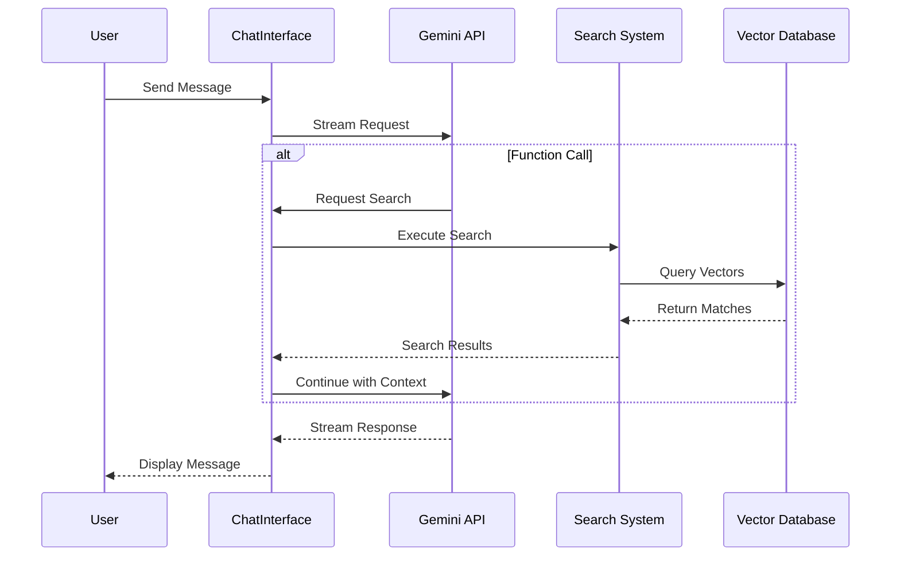
```mermaid
sequenceDiagram
    participant User
    participant Chat as ChatInterface
    participant Gemini as Gemini API
    participant RAG as Search System
    participant DB as Vector Database

    User->>Chat: Send Message
    Chat->>Gemini: Stream Request
    
    alt Function Call
        Gemini->>Chat: Request Search
        Chat->>RAG: Execute Search
        RAG->>DB: Query Vectors
        DB-->>RAG: Return Matches
        RAG-->>Chat: Search Results
        Chat->>Gemini: Continue with Context
    end
    
    Gemini-->>Chat: Stream Response
    Chat-->>User: Display Message
```

### 9.3 System Components

1. **Message Management**:
   - Message type definition
   - Real-time updates
   - History tracking
   - Stream handling

2. **Function System**:
   ```typescript
   const searchDocumentsTool: Tool = {
     functionDeclarations: [{
       name: "search_pitch_documents",
       description: "Searches relevant document chunks for the current pitch deck",
       parameters: {
         type: SchemaType.OBJECT,
         properties: {
           userQuery: SchemaType.STRING,
           pitchDeckId: SchemaType.STRING
         }
       }
     }]
   }
   ```

3. **System Instructions**:
   - Role definition
   - Specialized agent configuration
   - Context-aware responses
   - RAG integration guidance

### 9.4 RAG Integration

1. **Search Process**:
   - Query embedding generation
   - Vector similarity search
   - Content chunking
   - Result formatting

2. **Context Management**:
   - Document retrieval
   - Content integration
   - Response generation
   - History preservation

3. **Performance Features**:
   - Streaming responses
   - Real-time updates
   - Error handling
   - Loading states

## 10. Page Infrastructure

### 10.1 Dashboard System (`pitchcraft-app/src/pages/DashboardPage.tsx`)
- Main project management interface
- Features:
  - Project listing and creation
  - Deck management
  - Project status tracking
  - User context integration
  - Supabase data synchronization

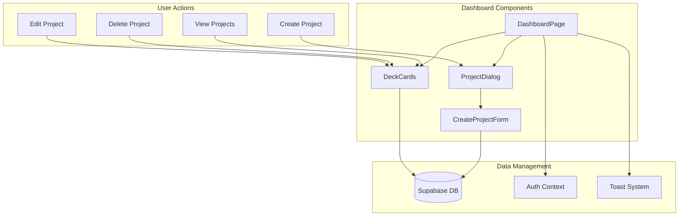
```mermaid
graph TB
    subgraph Dashboard [Dashboard Components]
        Page[DashboardPage]
        Create[CreateProjectForm]
        Cards[DeckCards]
        Dialog[ProjectDialog]
    end

    subgraph DataLayer [Data Management]
        DB[(Supabase DB)]
        Auth[Auth Context]
        Toast[Toast System]
    end

    subgraph UserFlow [User Actions]
        List[View Projects]
        New[Create Project]
        Delete[Delete Project]
        Edit[Edit Project]
    end

    Page --> Auth
    Page --> Toast
    Page --> Cards
    Page --> Dialog
    Dialog --> Create
    Create --> DB
    Cards --> DB
    List --> Cards
    New --> Dialog
    Delete --> Cards
    Edit --> Cards
```

### 10.2 Editor System (`pitchcraft-app/src/pages/DeckEditorPage.tsx`)
- Integrated pitch deck editor
- Tab-based navigation:
  - Agent: AI interaction
  - Scrape: URL content extraction
  - Upload: File management
  - Search: Content discovery
  - Research: Market analysis

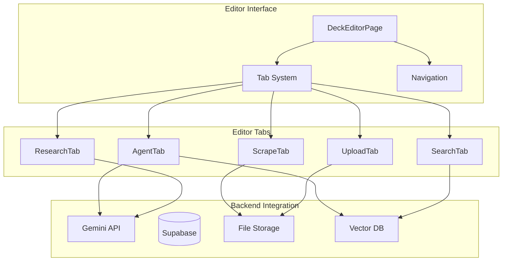
```mermaid
graph TB
    subgraph EditorUI [Editor Interface]
        MainPage[DeckEditorPage]
        TabSystem[Tab System]
        Header[Navigation]
    end

    subgraph Tabs [Editor Tabs]
        Agent[AgentTab]
        Scrape[ScrapeTab]
        Upload[UploadTab]
        Search[SearchTab]
        Research[ResearchTab]
    end

    subgraph BackendSystems [Backend Integration]
        Gemini[Gemini API]
        Supabase[(Supabase)]
        Storage[File Storage]
        Vectors[Vector DB]
    end

    MainPage --> TabSystem
    MainPage --> Header
    TabSystem --> Agent
    TabSystem --> Scrape
    TabSystem --> Upload
    TabSystem --> Search
    TabSystem --> Research

    Agent --> Gemini
    Agent --> Vectors
    Scrape --> Storage
    Upload --> Storage
    Search --> Vectors
    Research --> Gemini
```

### 10.3 Component Integration

1. **Navigation System**:
   - Back to dashboard
   - Project context
   - Tab navigation
   - Loading states

2. **Data Flow**:
   - Project metadata
   - Content synchronization
   - Real-time updates
   - Error handling

3. **UI Components**:
   ```typescript
   const tabs = [
     { id: 'agent', label: 'Agent', content: <AgentTab /> },
     { id: 'scrape', label: 'Scrape', content: <ScrapeTab /> },
     { id: 'upload', label: 'Upload', content: <UploadTab /> },
     { id: 'search', label: 'Search', content: <SearchTab /> },
     { id: 'research', label: 'Research', content: <ResearchTab /> }
   ]
   ```

### 10.4 Integration Points

1. **Auth Integration**:
   - User context
   - Permission validation
   - Session management
   - Access control

2. **Database Syncing**:
   - Project updates
   - Content storage
   - Metadata management
   - Error recovery

3. **API Communication**:
   - AI services
   - File processing
   - Content extraction
   - Search functionality

## 11. Future Development (Staging)

### 11.1 Research & Ingestion Systems

#### GPT Researcher Integration (`staging/gpt-researcher-master.zip`)
- Automated research capabilities
- Integration with existing search
- Corpus building improvements
- Source verification

#### Tavily Integration Suite
- Content extraction: `staging/tavily-extracted/`
- Company research: `staging/tavily_company_researcher-main/`
- JavaScript SDK: `staging/tavily-js-main/`
- MCP integration: `staging/tavily-mcp-main/`

```mermaid
graph TB
    subgraph Research [Research Systems]
        GPT[GPT Researcher]
        Tavily[Tavily Suite]
        Browser[Browser Base]
        Crawler[Web Crawler]
    end

    subgraph Integration [MCP Integration]
        MCP[MCP Server]
        PlayWright[Playwright MCP]
        OCR[OCR System]
        DART[Dart Server]
    end

    subgraph AI [AI Systems]
        Gemini[Gemini Models]
        Claude[Claude Integration]
        GenAI[GenAI Toolbox]
        Functions[Function Calling]
    end

    GPT --> MCP
    Tavily --> MCP
    Browser --> PlayWright
    Crawler --> OCR
    MCP --> Gemini
    MCP --> Claude
    GenAI --> Functions
```

### 11.2 MCP Server Infrastructure

#### Core Systems
1. **Base MCP Server** (`staging/mcp/`)
   - Core protocol implementation
   - Server infrastructure
   - Plugin architecture
   - Memory management

2. **Specialized Servers**
   - Dart implementation: `staging/dart-mcp-server-main/`
   - OCR capabilities: `staging/ocr-mcp-server.md`
   - Browser automation: `staging/browserbase.mcp.simplified.md`

3. **AI Integration**
   - Gemini models: `staging/gemini-models/`
   - Claude integration: `staging/claude-code-main/`
   - GenAI toolbox: `staging/genai-toolbox-main/`

### 11.3 Development Tools

#### Documentation & Examples
- Function calling: `staging/functioncall.md`
- File API specs: `staging/filesapi.md`
- Client usage: `staging/example.client.md`
- UI mockups: `staging/new-ui-mockup/`

#### Tool Integration
1. **Web Automation**
   - Playwright MCP: `staging/playwright-mcp-main.zip`
   - Web crawling: `staging/crawl4ai.mcp.md`
   - Browser base: `staging/browserbase.mcp.simplified.md`

2. **AI Tools**
   - Google ADK: `staging/google-adk-sdk-python/`
   - Aider MCP: `staging/aider-mcp-server-main/`
   - Just Prompt: `staging/just-prompt-main/`

### 11.4 Development Roadmap

1. **Research Enhancement**
   - Advanced content extraction
   - Multi-source research
   - Content verification
   - Source ranking

2. **AI Integration**
   - Model coordination
   - Function orchestration
   - Memory management
   - Training pipelines

3. **Data Processing**
   - OCR improvements
   - File type support
   - Processing speed
   - Error handling

4. **Infrastructure**
   - MCP standardization
   - Server scalability
   - Plugin architecture
   - Monitoring tools

## 12. Data Management Layer

### 12.1 Data Hooks

#### PitchDeck Hook (`pitchcraft-app/src/hooks/usePitchDeck.ts`)
- Core data management hook
- CRUD operations for pitch decks
- Supabase integration
- Type-safe operations using generated types
```typescript
type PitchDeck = Database['public']['Tables']['pitch_decks']['Row']
type PitchDeckInsert = Database['public']['Tables']['pitch_decks']['Insert']
type PitchDeckUpdate = Database['public']['Tables']['pitch_decks']['Update']
```

```mermaid
sequenceDiagram
    actor Component
    participant Hook
    participant Auth
    participant DB

    Component->>Hook: Call Function
    Hook->>Hook: Set Loading
    Hook->>Auth: Get User
    Auth-->>Hook: User Data
    Hook->>DB: Execute
    DB-->>Hook: Result
    Hook->>Hook: Handle State
    Hook-->>Component: Return
```

### 12.2 Hook Operations

#### Create Operation
```typescript
const createPitchDeck = async (deck: Omit<PitchDeckInsert, 'user_id'>) => {
  const { data: { user } } = await supabase.auth.getUser()
  const { data } = await supabase
    .from('pitch_decks')
    .insert([{ ...deck, user_id: user.id }])
    .select()
    .single()
  return data
}
```

#### Read Operations
1. **Single Deck**:
   ```typescript
   const getPitchDeck = async (id: string) => {
     const { data } = await supabase
       .from('pitch_decks')
       .select('*, slides(*)')
       .eq('id', id)
       .single()
     return data
   }
   ```

2. **User's Decks**:
   ```typescript
   const getUserPitchDecks = async () => {
     const { data } = await supabase
       .from('pitch_decks')
       .select('*')
       .eq('user_id', user.id)
       .order('created_at', { ascending: false })
     return data
   }
   ```

### 12.3 Hook Integration

```mermaid
graph TB
    subgraph Components [React Components]
        Dashboard[DashboardPage]
        Editor[DeckEditorPage]
        Form[CreateProjectForm]
    end

    subgraph DataLayer [Data Management]
        Hook[usePitchDeck]
        State[Loading/Error State]
        Types[Type Definitions]
    end

    subgraph Backend [Backend Services]
        Auth[Supabase Auth]
        DB[Supabase Database]
    end

    Dashboard --> Hook
    Editor --> Hook
    Form --> Hook
    Hook --> State
    Hook --> Types
    Hook --> Auth
    Hook --> DB
```

### 12.4 Error Handling

1. **State Management**:
   ```typescript
   const [isLoading, setIsLoading] = useState(false)
   const [error, setError] = useState<string | null>(null)
   ```

2. **Error Cases**:
   - Authentication failures
   - Database errors
   - Network issues
   - Type validation

3. **Error Recovery**:
   - State cleanup
   - User feedback
   - Operation retry
   - Graceful degradation

